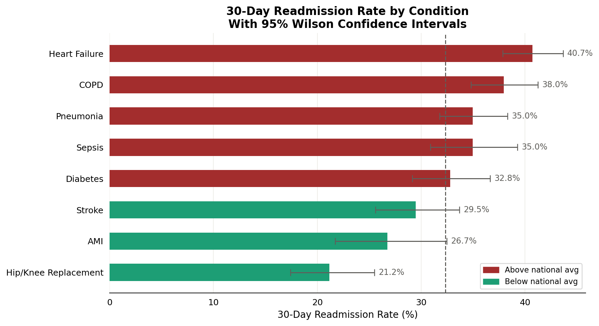
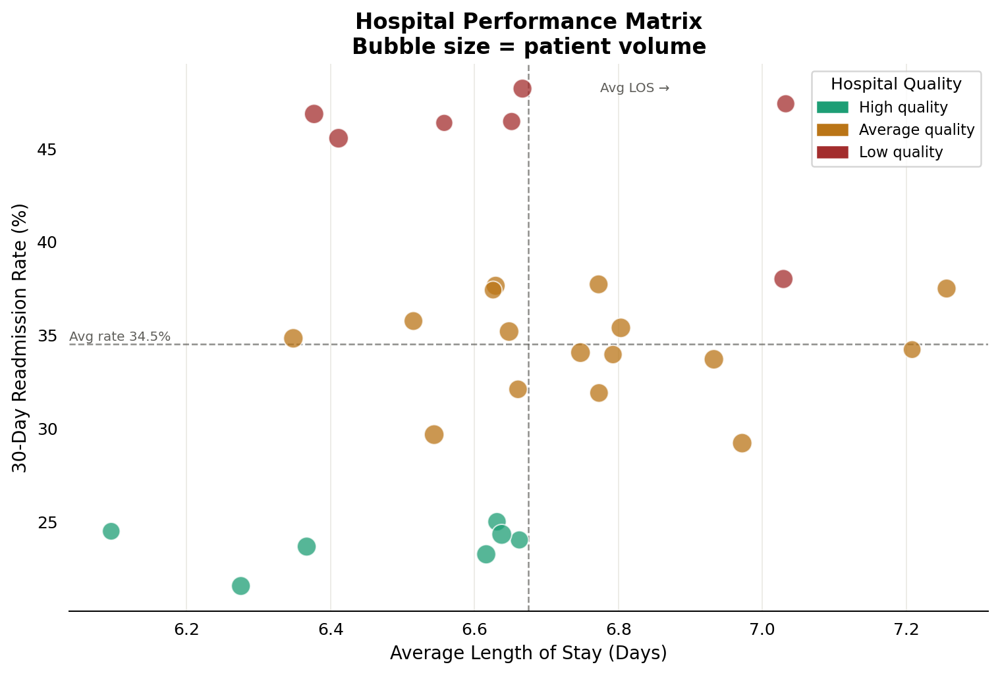
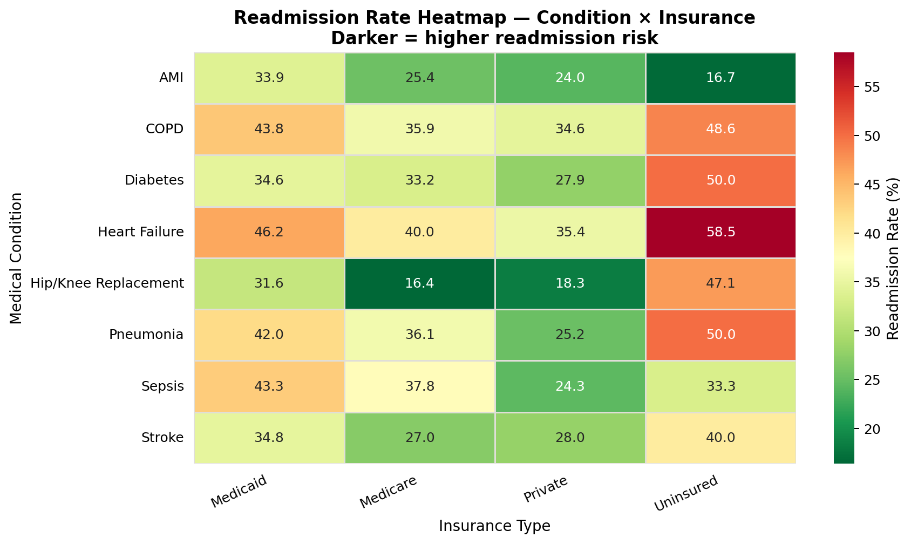
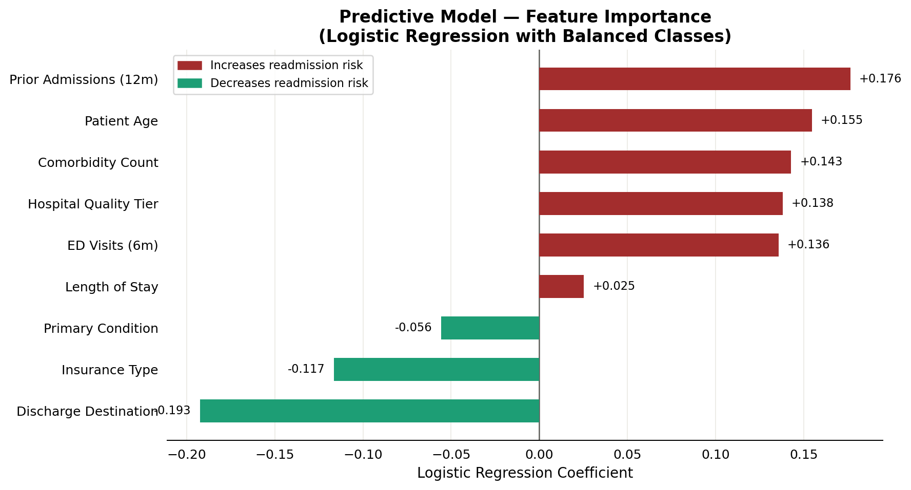
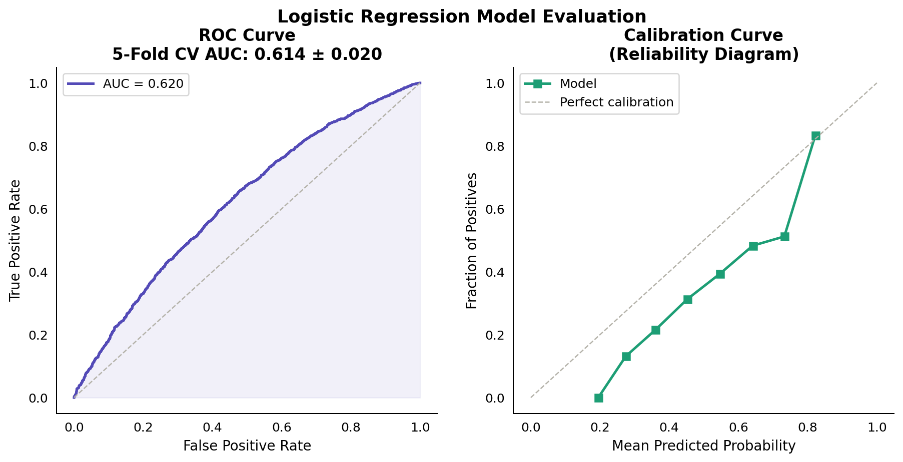
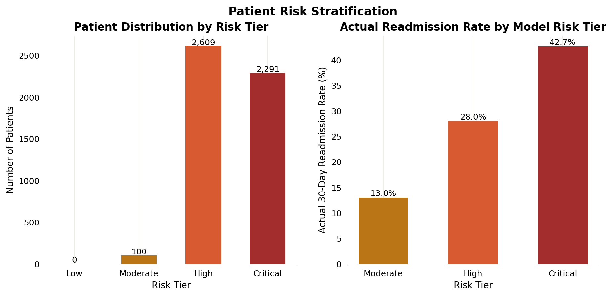

# 🏥 Hospital 30-Day Readmissions — End-to-End Analytics Project

> *Exploratory analysis, statistical hypothesis testing, and a logistic regression readmission risk model — built on a CMS HRRP-calibrated dataset of 5,000 patient encounters.*

[](https://python.org)
[](https://scikit-learn.org)
[](LICENSE)

---

## Overview

Hospital readmissions within 30 days are a key quality metric under the [CMS Hospital Readmissions Reduction Program (HRRP)](https://www.cms.gov/medicare/payment/prospective-payment-systems/acute-inpatient-pps/hospital-readmissions-reduction-program-hrrp), which penalizes hospitals with excess readmission rates. This project conducts a full analytical pipeline:

1. **Data generation** — CMS HRRP-calibrated synthetic dataset with 18 clinical and administrative features
2. **Exploratory Data Analysis** — readmission rates by condition, hospital, insurance, discharge destination, and age cohort
3. **Statistical hypothesis testing** — chi-square tests with Cramér's V effect sizes; Wilson confidence intervals; independent t-tests with Cohen's d
4. **Predictive modeling** — logistic regression with 5-fold stratified cross-validation, calibration diagnostics, and feature importance
5. **Risk stratification** — patient-level risk scoring into four tiers (Low → Critical) validated against actual readmission rates
6. **Executive report** — self-contained HTML report with embedded charts, statistical tables, and actionable recommendations

---

## Key Results

| Metric | Value |
|---|---|
| Overall 30-day readmission rate | **23.3%** (benchmark: < 15%) |
| Highest-risk condition | **Heart Failure** |
| Highest-risk insurance | **Uninsured** |
| Predictive Model CV AUC | **0.614 ± 0.020** |
| Patients in High/Critical tier | **~28%** |
| Statistically significant predictors | **5 of 5** tested (p < 0.001) |

> **Note:** An AUC of ~0.62 is consistent with published logistic regression baselines for 30-day readmission prediction. The LACE Index — widely used in clinical practice — achieves ~0.68 AUC. Gradient boosting models typically reach 0.72–0.78.

---

## Project Structure

```
hospital-readmissions/
│
├── src/
│   ├── data_generator.py     # CMS-calibrated synthetic data generation
│   ├── stats_analysis.py     # Chi-square, t-tests, Wilson CI, odds ratios
│   ├── model.py              # Logistic regression pipeline + scoring
│   ├── charts.py             # Publication-quality matplotlib/seaborn charts
│   └── report_builder.py     # Self-contained HTML executive report
│
├── data/
│   ├── raw/
│   │   └── hospital_readmissions.csv    # 5,000-patient dataset (18 features)
│   └── processed/
│       ├── scored_patients.csv          # With model risk scores + tier
│       ├── condition_rates.csv          # Rates with 95% Wilson CI
│       ├── feature_importance.csv       # Model coefficients
│       ├── chi_square_results.csv       # Hypothesis test results
│       └── risk_tier_profile.csv        # Tier summary statistics
│
├── outputs/
│   ├── charts/
│   │   ├── 01_condition_rates_ci.png    # Rates + confidence intervals
│   │   ├── 02_hospital_matrix.png       # Performance scatter matrix
│   │   ├── 03_cohort_heatmap.png        # Condition × Insurance heatmap
│   │   ├── 04_feature_importance.png    # Model feature coefficients
│   │   ├── 05_model_performance.png     # ROC + Calibration curves
│   │   └── 06_risk_tiers.png            # Risk tier distribution + validation
│   └── report/
│       └── executive_report.html        # Full self-contained report
│
├── sql/
│   └── readmissions_queries.sql         # 7 analytical queries (CTEs, window fns)
│
├── run_analysis.py           # End-to-end pipeline entry point
├── requirements.txt
└── README.md
```

---

## Quickstart

```bash
git clone https://github.com/Divyadhole/hospital-readmissions.git
cd hospital-readmissions

pip install -r requirements.txt

python run_analysis.py
```

Open `outputs/report/executive_report.html` in your browser for the full report.

---

## Analytical Methods

### Statistical Testing
- **Chi-square test of independence** (all categorical predictors vs readmission)
- **Wilson score confidence intervals** (exact coverage, avoids normal approximation breakdown at boundary rates)
- **Independent samples t-test (Welch's)** with Cohen's d effect size (LOS analysis)
- **Odds ratios** for binary risk factor thresholds (prior admits, ED visits, comorbidities)

### Predictive Model
- **Algorithm:** Logistic Regression (L2 regularization, C=0.5)
- **Imbalance handling:** `class_weight="balanced"`
- **Validation:** 5-fold stratified cross-validation (no data leakage)
- **Metrics:** AUC-ROC, Average Precision, Calibration (reliability diagram)
- **Explainability:** Signed logistic regression coefficients per feature

### Risk Stratification
Predicted probabilities are binned into four clinically actionable tiers:

| Tier | Threshold | Intervention |
|---|---|---|
| Low | < 15% | Standard discharge |
| Moderate | 15–30% | Follow-up call within 7 days |
| High | 30–50% | Care management referral |
| Critical | > 50% | Intensive transitional care protocol |

---

## Charts

### Fig 1 — Readmission Rate by Condition (with 95% CI)


### Fig 2 — Hospital Performance Matrix


### Fig 3 — Condition × Insurance Heatmap


### Fig 4 — Feature Importance


### Fig 5 — Model Performance (ROC + Calibration)


### Fig 6 — Risk Tier Stratification


---

## SQL Highlights

The `sql/readmissions_queries.sql` file demonstrates:

- **Window functions** — `RANK() OVER`, `NTILE()`, `LAG()`
- **CTEs** — multi-step analytical pipelines
- **Conditional aggregation** — `CASE WHEN` inside `AVG()`
- **Relative risk computation** — inline cross-group division
- **Composite scoring** — weighted rule-based risk index in pure SQL

---

## Limitations

- Dataset is synthetic — calibrated to CMS distributions but not actual claims data
- Logistic regression assumes log-linear relationships — tree-based models may improve AUC
- Social determinants of health (housing, food access, transportation) not included
- No temporal validation — production models require time-based train/test splits

---

## Skills Demonstrated

| Category | Tools / Techniques |
|---|---|
| Data Engineering | pandas, NumPy, reproducible seed |
| Statistics | Chi-square, Wilson CI, t-test, effect sizes |
| Machine Learning | sklearn Pipeline, cross-validation, calibration |
| Visualization | matplotlib, seaborn, custom style system |
| SQL | CTEs, window functions, risk scoring |
| Communication | Executive HTML report, structured recommendations |
| Software Practice | Modular `src/` package, `requirements.txt`, `.gitignore` |

---


